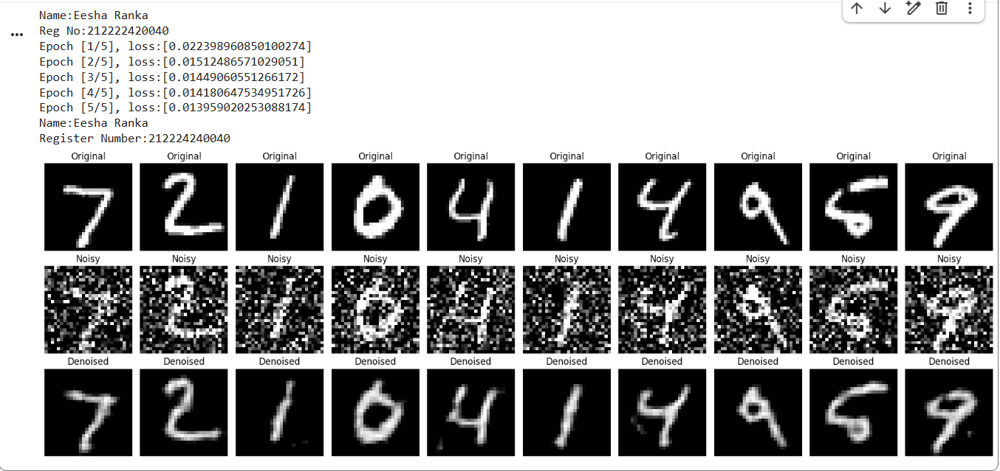

# DL- Convolutional Autoencoder for Image Denoising

## AIM
To develop a convolutional autoencoder for image denoising application.

## Problem Statement and Dataset
To build and train a Denoising Autoencoder using PyTorch to remove noise from images. The goal is to reconstruct a clean image from a corrupted (noisy) input image. The MNIST dataset is used as a benchmark to demonstrate this image denoising capability.
The dataset used in this code is the MNIST dataset. It's a large database of handwritten digits commonly used for training various image processing systems. Each image in the MNIST dataset is a grayscale image of a handwritten digit (0-9) with a size of 28x28 pixels.

## DESIGN STEPS
### STEP 1: 
Import Libraries and Device Setup: Import necessary PyTorch and utility libraries, then configure the device for computation (CPU/GPU).

### STEP 2: 
Prepare Dataset and Add Noise: Load the MNIST dataset, apply transformations, create DataLoaders, and define a function to add noise to images.


### STEP 3: 
Define Denoising Autoencoder Architecture: Design the Denoising Autoencoder model with convolutional encoder and transpose convolutional decoder layers.


### STEP 4: 
Initialize Model, Loss, and Optimizer: Instantiate the Denoising Autoencoder, set up the Mean Squared Error (MSE) loss, and choose the Adam optimizer.


### STEP 5: 
Implement Training Loop: Create a training function that iterates through epochs, adds noise, performs forward/backward passes, and updates model weights.


### STEP 6: 
Visualize Denoising Performance: Develop a visualization function to display original, noisy, and denoised images from the test set for evaluation.


## PROGRAM

### Name:Eesha Ranka

### Register Number:212224240040

```python
# Autoencoder Definition
class DenoisingAutoencoder(nn.Module):
     def __init__(self):
      super(DenoisingAutoencoder,self).__init__()
      self.encoder=nn.Sequential(
          nn.Conv2d(1,16,kernel_size=3,stride=2,padding=1),
          nn.ReLU(),
          nn.Conv2d(16,32,kernel_size=3,stride=2,padding=1),
          nn.ReLU()
      )
      self.decoder=nn.Sequential(
          nn.ConvTranspose2d(32,16,kernel_size=3,stride=2,output_padding=1,padding=1),
          nn.ReLU(),
          nn.ConvTranspose2d(16,1,kernel_size=3,stride=2,output_padding=1,padding=1),
          nn.ReLU()

      )


    def forward(self, x):
        x=self.encoder(x)
        x=self.decoder(x)
        return x


# Initialize model, loss function and optimizer
model =DenoisingAutoencoder().to(device)
criterion =nn.MSELoss()
optimizer =optim.Adam(model.parameters(),lr=1e-3)# Initialize model, loss function and optimizer


# Train the autoencoder
def train(model, loader, criterion, optimizer, epochs=5):
    model.train()
    print("Name:Eesha Ranka")
    print("Reg No:212222420040")
    for epoch in range(epochs):
        running_loss = 0.0
        for images,_ in loader:
          images=images.to(device)
          noisy_images=add_noise(images).to(device)

          #forward pass
          outputs=model(noisy_images)
          loss=criterion(outputs,images)

          #backward pass
          optimizer.zero_grad()
          loss.backward()
          optimizer.step()

          running_loss+=loss.item()

        print(f"Epoch [{epoch+1}/{epochs}], loss:[{running_loss/len(loader)}]")


# Evaluate and visualize
def visualize_denoising(model, loader, num_images=10):
    model.eval()
    with torch.no_grad():
        for images, _ in loader:
            images = images.to(device)
            noisy_images = add_noise(images).to(device)
            outputs = model(noisy_images)
            break

    images = images.cpu().numpy()
    noisy_images = noisy_images.cpu().numpy()
    outputs = outputs.cpu().numpy()

    print("Name:Eesha Ranka")
    print("Register Number:212224240040")
    plt.figure(figsize=(18, 6))
    for i in range(num_images):
        # Original
        ax = plt.subplot(3, num_images, i + 1)
        plt.imshow(images[i].squeeze(), cmap='gray')
        ax.set_title("Original")
        plt.axis("off")

        # Noisy
        ax = plt.subplot(3, num_images, i + 1 + num_images)
        plt.imshow(noisy_images[i].squeeze(), cmap='gray')
        ax.set_title("Noisy")
        plt.axis("off")

        # Denoised
        ax = plt.subplot(3, num_images, i + 1 + 2 * num_images)
        plt.imshow(outputs[i].squeeze(), cmap='gray')
        ax.set_title("Denoised")
        plt.axis("off")

    plt.tight_layout()
    plt.show()


```

### OUTPUT

### Model Summary
```
----------------------------------------------------------------
        Layer (type)               Output Shape         Param #
================================================================
            Conv2d-1           [-1, 16, 14, 14]             160
              ReLU-2           [-1, 16, 14, 14]               0
            Conv2d-3             [-1, 32, 7, 7]           4,640
              ReLU-4             [-1, 32, 7, 7]               0
   ConvTranspose2d-5           [-1, 16, 14, 14]           4,624
              ReLU-6           [-1, 16, 14, 14]               0
   ConvTranspose2d-7            [-1, 1, 28, 28]             145
              ReLU-8            [-1, 1, 28, 28]               0
================================================================
Total params: 9,569
Trainable params: 9,569
Non-trainable params: 0
----------------------------------------------------------------
Input size (MB): 0.00
Forward/backward pass size (MB): 0.13
Params size (MB): 0.04
Estimated Total Size (MB): 0.17
----------------------------------------------------------------
```
### Training loss

## Original vs Noisy Vs Reconstructed Image


## RESULT
Thus the model has been trained.
